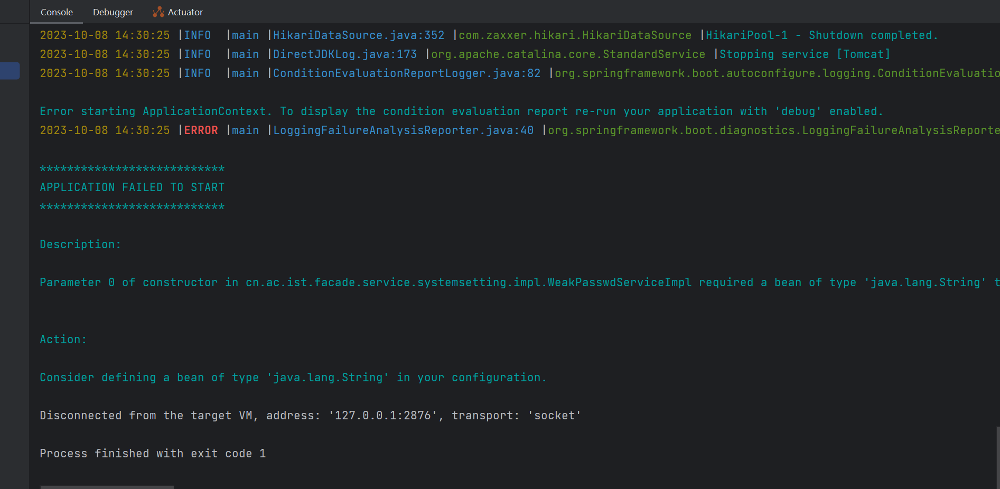

# @Value与构造方法冲突导致无法注入

1、不能存在构造方法

2、报错，无法注入



解决： `@AllArgsConstructor `和 `@Value `冲突

```
原因是@Value注解需要使用无参构造；而当我们不为一个类声明任何构造函数时，Java会默认为我们提供一个无参构造，而当我们显示地声明构造函数时，Java就不会为我们提供构造函数。而我却显示地声明了@AllArgsConstructor
```

