# VMware安装Ubuntu教程

## 一、VMware操作

### 1、采用经典安装

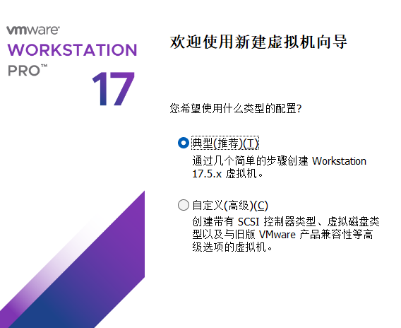

### 2、选择镜像

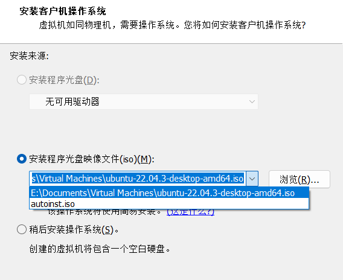

### 3、设置相关信息

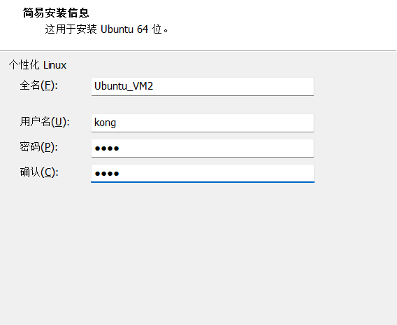

### 4、设置虚拟机名

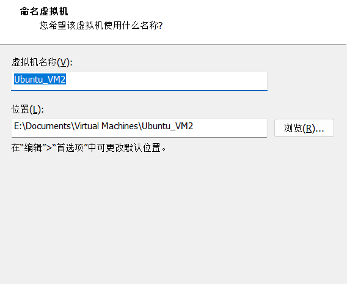

### 5、指定磁盘容量

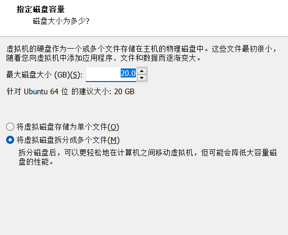

### 6、设置内存

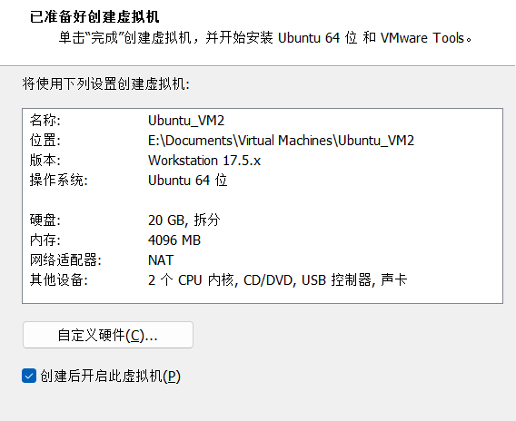

## 二、Ubuntu系统内操作

### 1、选择语言

这里直接Continue

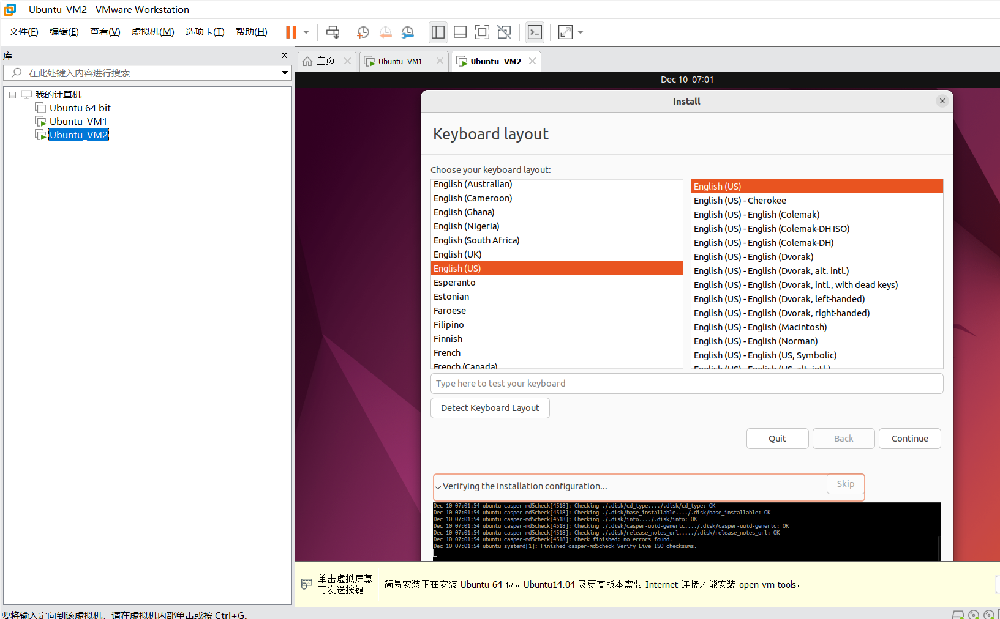

### 2、软件安装

这里直接Continue，然后等待。

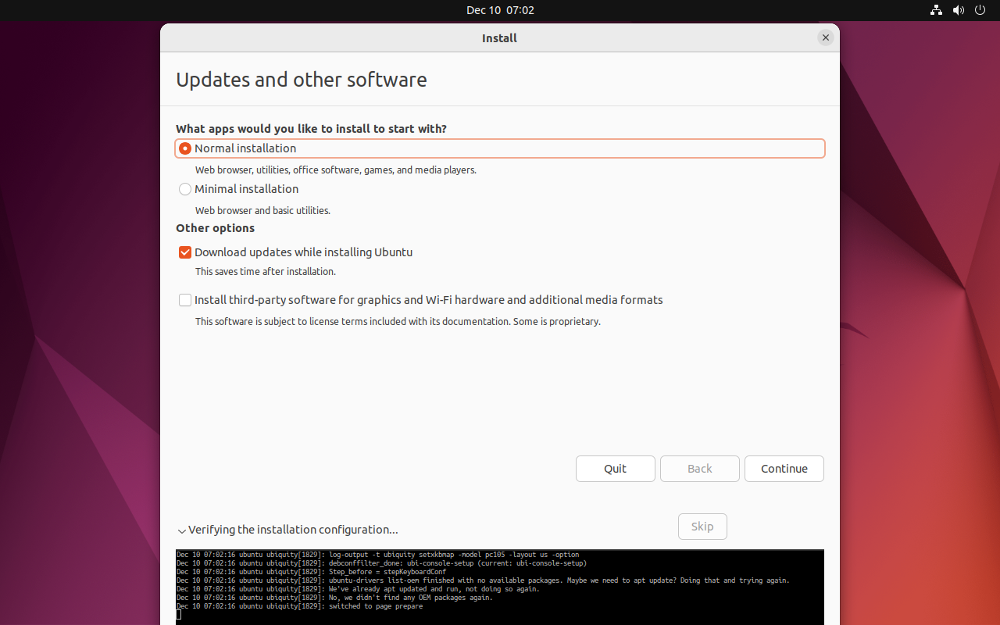


### 3、选择安装类型

这里直接Instal Now，然后等待。

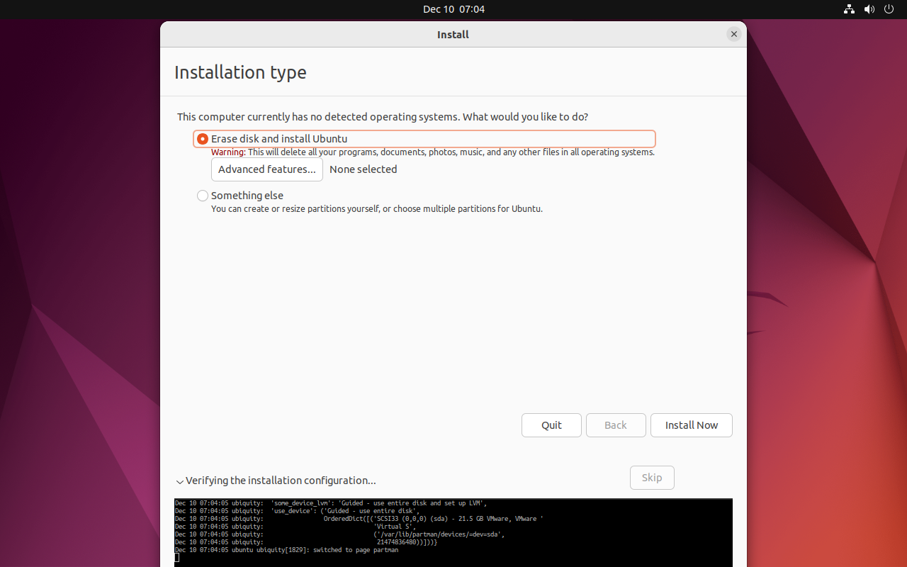

### 4、选择时区

这里选择 上海，然后Continue。

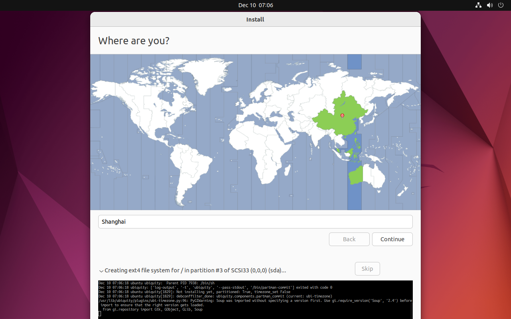

### 5、设置用户名密码

填写系统名、用户名、密码，然后Continue，这里等待比较久。

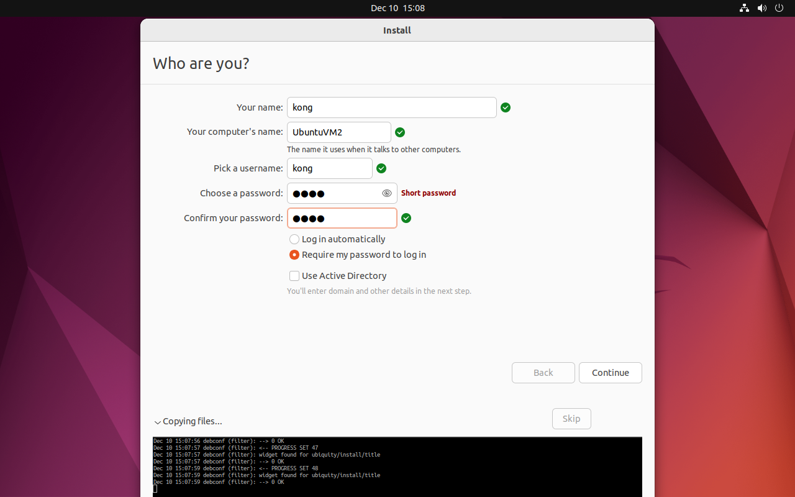

### 6、重启

加载完成后需要重启

## 三、系统配置【重要】

### 1、安装ssh

```shell
sudo apt update
sudo apt install openssh-server
```

### 2、配置root密码

```shell
sudo passwd root
```

### 3、配置apt-get源

清华源：https://mirrors.tuna.tsinghua.edu.cn/help/ubuntu/

- 修改镜像源，打开配置文件，将镜像源链接粘贴到配置文件

```shell
sudo mv /etc/apt/sources.list /etc/apt/sources.list_bak
sudo vi /etc/apt/sources.list
```

vim后粘贴这个

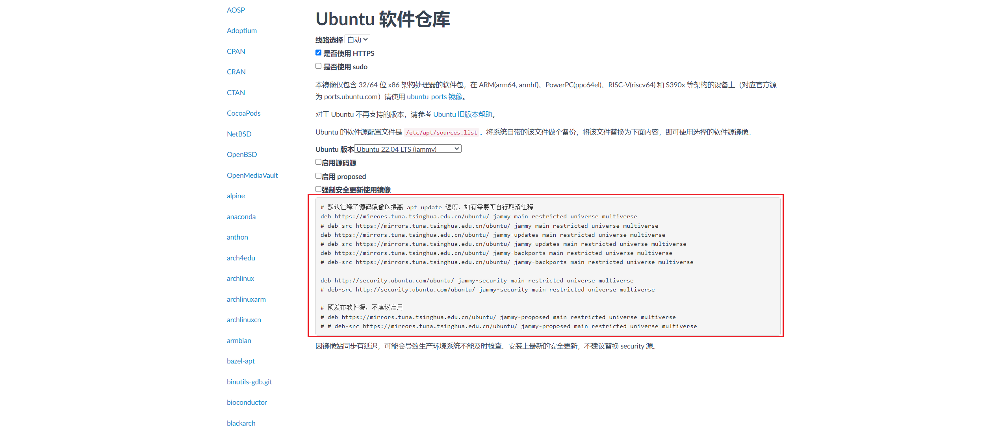

- 更新软件列表到本地

```shell
sudo apt-get update
```

- 更新所有软件（非必要）

```shell
sudp apt-get upgrade
```

### 4、配置静态IP地址

#### 方法一：可视化配置

##### 1、进入设置

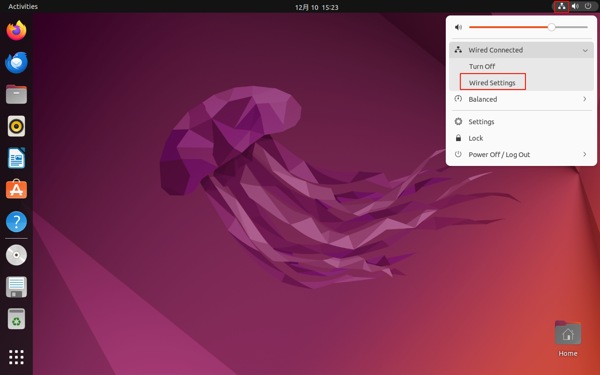

##### 2、网卡设置

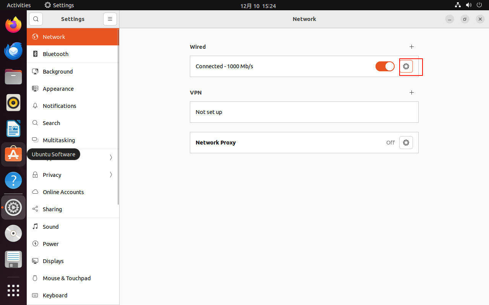

##### 3、设置IP以及网关

注：网关以及网段要配置一致

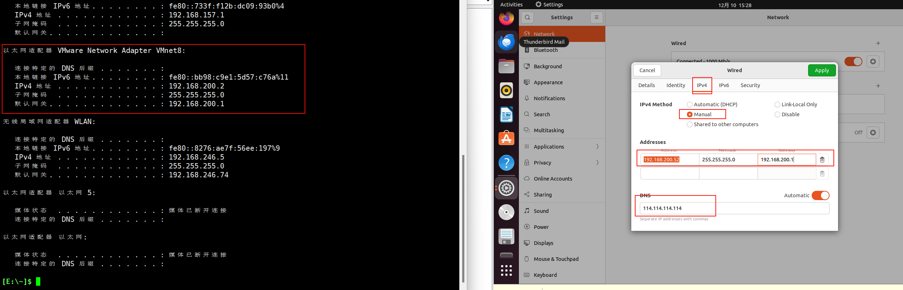

##### 4、重启网卡

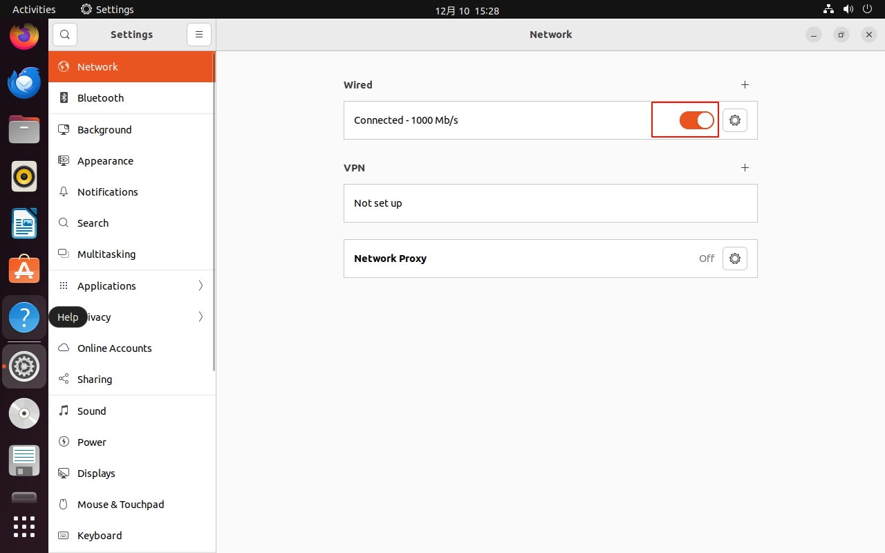

##### 5、效果

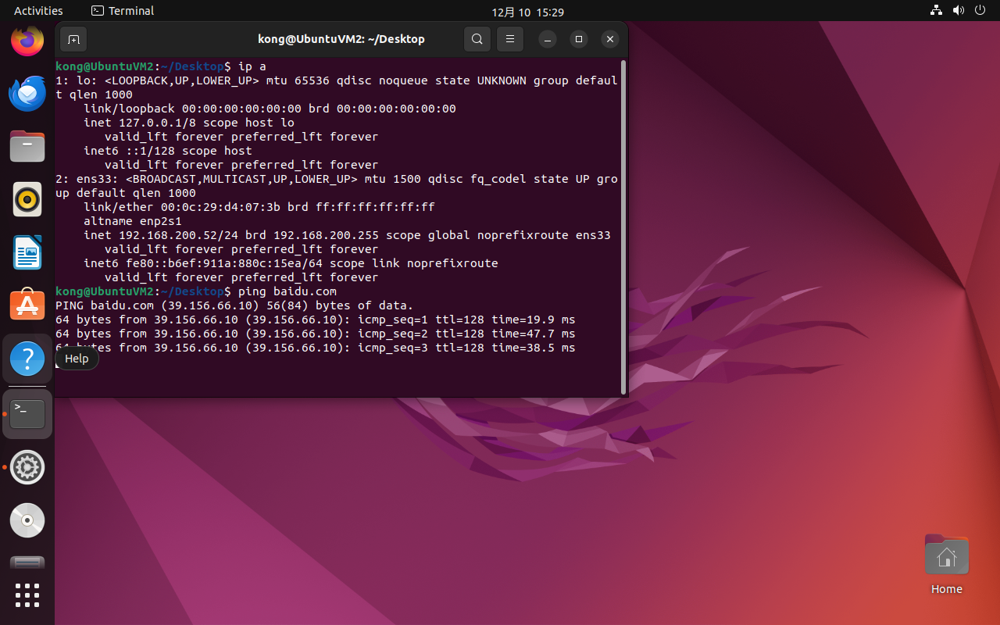

#### 方法二：命令行

```shell
# 查看网卡
ip a
# 进入配置文件所在目录
cd /etc/netplan
# 查看目录下的内容
ls
# 备份配置
sudo cp 01-network-manager-all.yaml 01-network-manager-all.yaml_bak
# 打开配置文件进行修改
sudo vim 01-network-manager-all.yaml

network:
  ethernets:
    ens33:
      addresses: [192.168.200.52/24]          	# 设置静态IP地址和掩码
      gateway4: 192.168.200.1             		# 设置网关地址
      dhcp4: false                            	# 禁用dhcp
      nameservers:
        addresses: [114.114.114.114, 8.8.8.8] # 设置主、备DNS
  version: 2
  renderer: NetworkManager
```