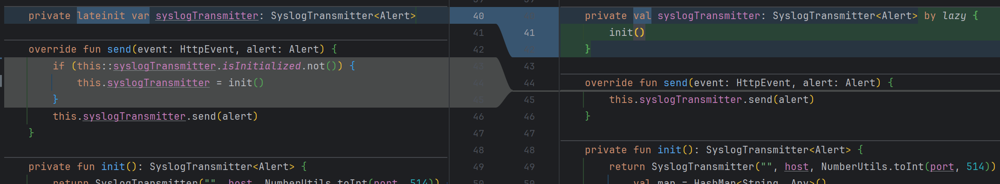
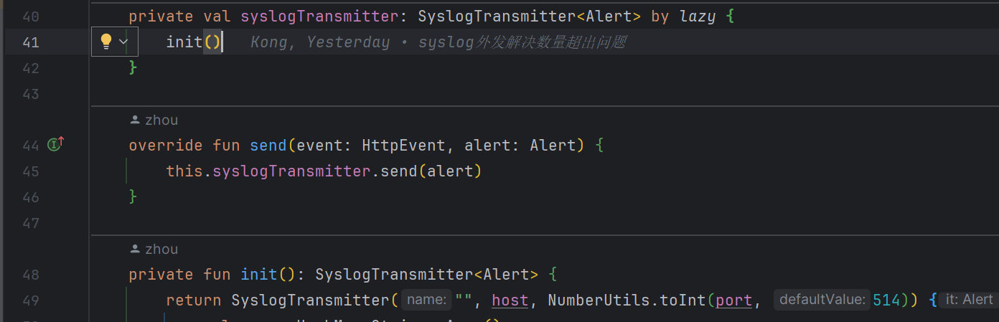
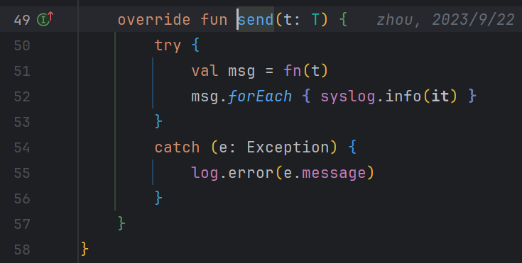

# 多线程情况下可能会导致RsysLog发送日志数量异常（数量超出）



注：左侧代码会出现数量异常，右侧正常

```Java
    override fun send(event: HttpEvent, alert: Alert) {
        this.syslogTransmitter.send(alert)
    }
```

如图将init函数进行了单例，避免了发送日志数量异常，可能还需要加一个双重检查锁




